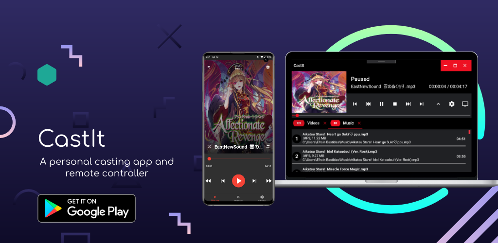
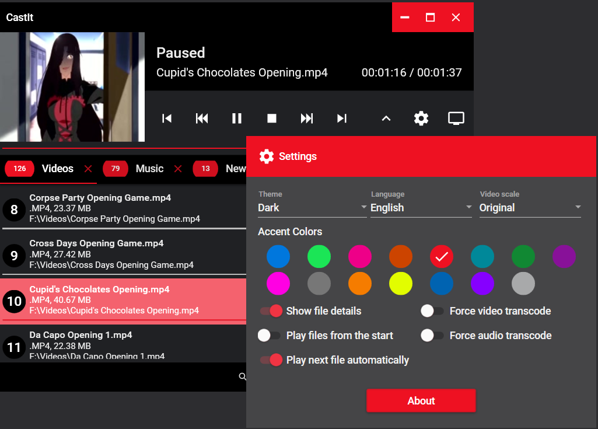
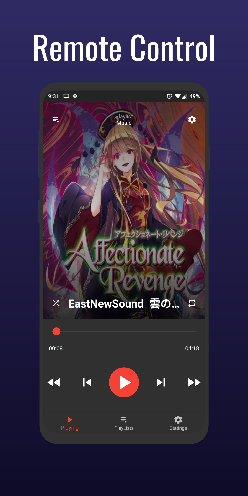
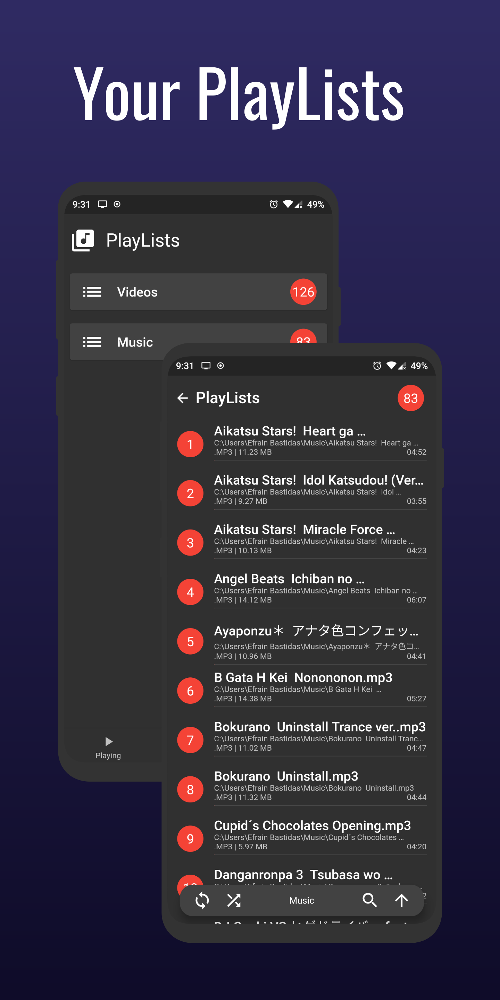
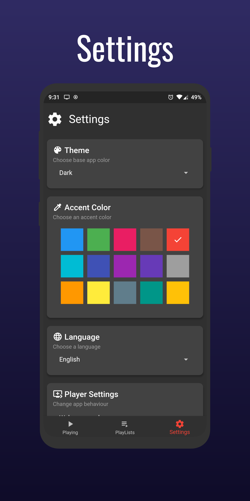

# CastIt

  

> A casting app and remote controller made for my personal use.

  

### Windows

  

      

      

Get the latest release [here](https://github.com/Wolfteam/CastIt/releases).

### Android

      
      
  

### Features
* Playlists
* Themes
* Drag and drop files
* And all the good stuff that comes in casting apps
